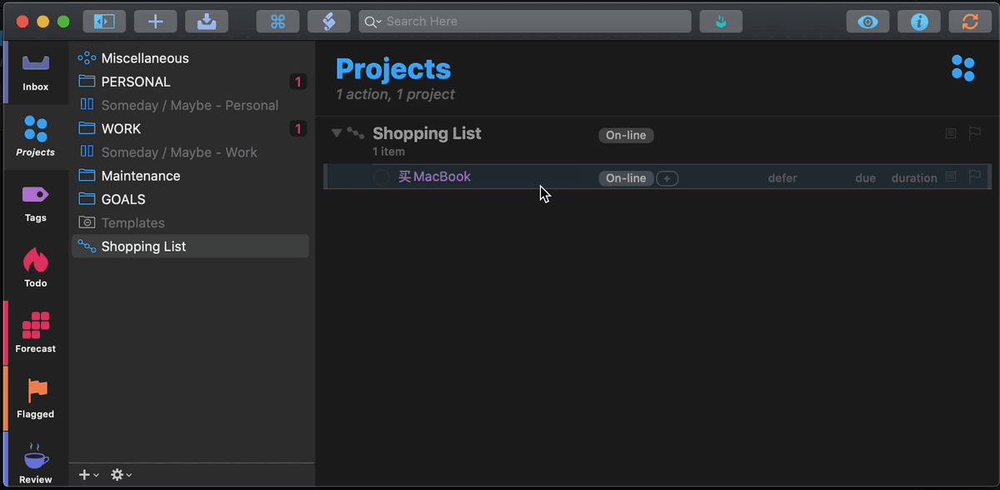

# Complete and Await Reply 

Mark the currently selected task as complete and add a new task to await the reply.

This script is based on the script from [OMNI-AUTOMATION.COM](https://omni-automation.com/omnifocus/plug-in-complete-await.html)

> It allows you to mark your currently selected task as complete, and duplicates the task with `Waiting on reply:` prefixed to the original task name.

## Changelog

### v0.2

#### Added

- New shopping list task processing: If the selected task start with `purchasingPrefix`, "买" as default, then a dialogue appears to let user choose where will the item he bought ship.
  

### v0.1

#### Added

- Fork the [original copy](https://omni-automation.com/omnifocus/plug-in-complete-await.html),
- Append reply time to the end of duplicated task's note,
- No more `Waiting on reply: Waiting on reply:` in the duplicated task's name.
